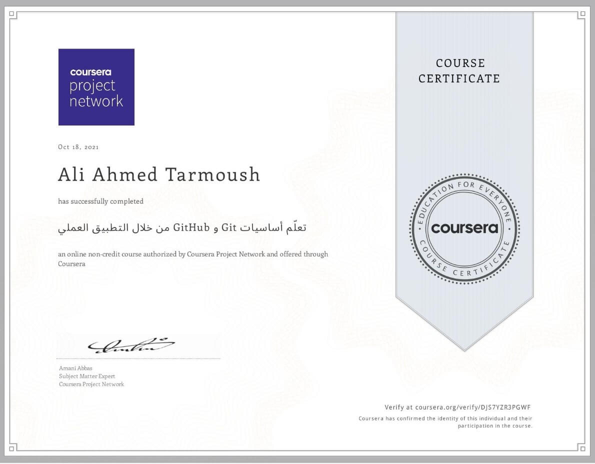

# تعلّم أساسيات Git و GitHub من خلال التطبيق العملي

## Offered by Coursera Project Network

## Sponsored by Syrian Youth Assembly

# About this Specialization

In this project-based course of approximately two hours, you will learn the basics of Git and GitHub through practical application.
At the end of this project you will be able to work with Git and use its commands. You will be able to create repositories and save copies of mods in it. You will also have a GitHub account where you will learn how to link it to the Git program on your device and how to upload your work and projects on this account.

 